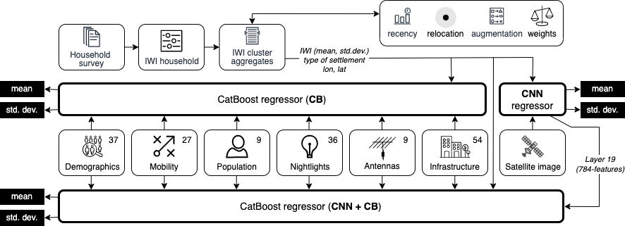
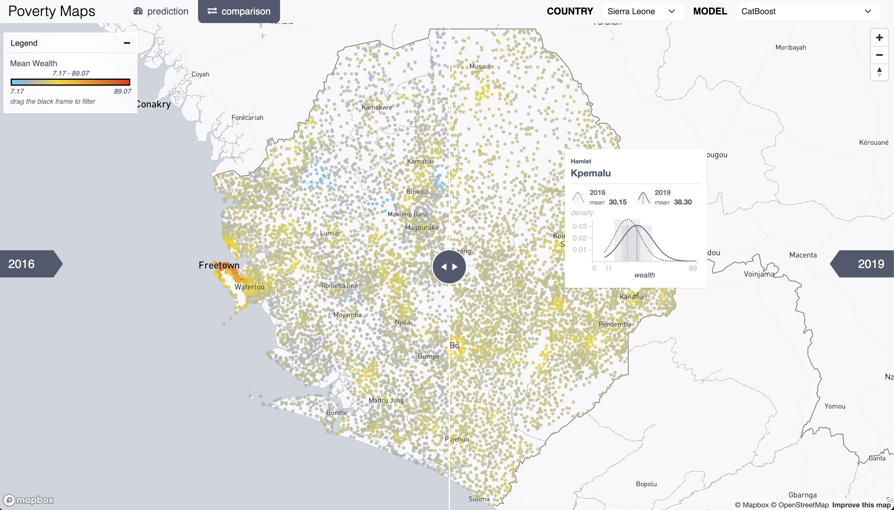

# PovertyMaps
Interpreting wealth distribution via poverty map inference using multimodal data

<picture>

</picture>

## Analysis (plots)
- Open [Main results](paper/main.ipynb) (or download figures [here](paper/main-plots))
- Open [Supplementary material](paper/supmat.ipynb) (or download figures [here](paper/supmat-plots))
  - Normal (Gaussian) Test on ground-truth
  - Descriptive Analysis on ground-truth
  - Pre-processing: Sample weights
  - Pre-processing: Data Recency (RMSE vs NRMSE)
  - Pre-processing: Ablation study using RMSE
  - Model and Feature Performance (R^2)
  - Variability all models
- Download [results](paper/results/)

## Interactive tool
Try out the [interactive tool](https://vis.csh.ac.at/poverty-maps) to see the high-resolution poverty map of Sierra Leone and Uganda.

Check how wealth may look now.
<picture>

</picture>

Check how wealth has changed over the years.
<picture>

</picture>

## Scripts
`cd scripts`

*Check [Pipeline.md](Pipeline.md) for step-by-step guidelines.*

1. Init: `./batch_init.sh -r ../data/Uganda -c UG -y 2016,2018 -n 10`
2. Features GT: `./batch_features.sh -r ../data/Uganda -c UG -y 2016,2018 -n10`
3. Features PP: `./batch_features.sh -r ../data/Uganda -c UG -n10`
4. Pre-processing: `./batch_preprocessing.sh -r ../data/Uganda -c UG -y 2016,2018 -o none -t all -k 5 -e 3`
5. CatBoost train&test: `./batch_xgb_train.sh -r ../data/Uganda -c UG -y 2016,2018 -l none -t all -a mean_wi,std_wi -f all -k 4 -v 1`
6. Augmentation: `python cnn_augmentation.py -r ../data/Uganda -years 2016,2018 -dhsloc none`
7. CNN train&test: `python cnn_train.py -r ../data/Uganda/ -years 2016,2018 -model cnn_mp_dp_relu_sigmoid_adam_mean_std_regression -yatt mean_wi,std_wi -dhsloc none -traintype all -kfold 5 -epochs 3 -patience 100 -njobs 1 -retrain 3`
8. CNN+XGB train&test: `./batch_xgb_train.sh -r ../data/Uganda -c UG -y 2016,2018 -l none -t all -a mean_wi,std_wi -f all -k 4 -v 1 -n offaug_cnn_mp_dp_relu_sigmoid_adam_mean_std_regression -e 19 -w 1`
9. Fmaps: `python cnn_predict.py -r ../data/Uganda/ -years 2016.,2018 -model cnn_mp_dp_relu_sigmoid_adam_mean_std_regression -yatt mean_wi,std_wi -dhsloc none -traintype all -fmlayer 19 -njobs 1`
9. Poverty maps: `python batch_infer_poverty_maps.py -ccode UG -model CB`
10. Cross-country testing: `python batch_cross_predictions.py`

## Citation
Lisette Espín-Noboa, János Kertész, and Márton Karsai. 2023. Interpreting wealth distribution via poverty map inference using multimodal data. In Proceedings of Association for Computing Machinery (TheWebConf ’23). ACM, New York, NY, USA, 12 pages. https://doi.org/10.1145/3543507.3583862

*Pre-print:* https://arxiv.org/abs/2302.10793

## Credits and Funding
<picture>

</picture>

<picture>

</picture>

<picture>

</picture>

## License
 This work is licensed under a <a rel="license" href="http://creativecommons.org/licenses/by-nc-sa/4.0/">Creative Commons Attribution-NonCommercial-ShareAlike 4.0 International License</a>.
